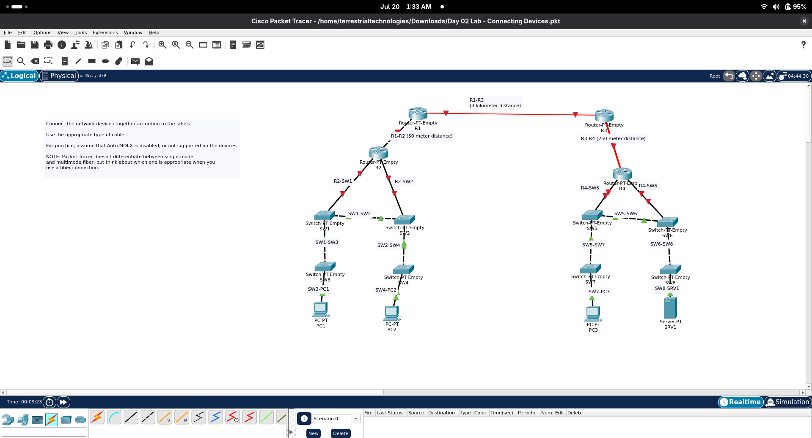

## Objective 

Connect network devices using the correct cable types based on devices being connected
(Assuming no Auto MDI-X) and distances between them which is shown in the topology.

## What I Did

- Connected routers, switches, endpoint devices according to topology labels
- selected the appropriate copper or fiber connection for the situation.
- used distance limits to determine when multi or single-mode might be best used.
- Followed Jeremy's IT lab video while completing the activity

  ## Things I Learned

  - Unlice devices such as a router and switch can use a straight-through ethernet
    cable
  - Similar devices, say two switches, require a crossover cable.
  - Routers, Firewalls, and Computers are all similar devices.
  - most devices nowadays are Auto MDI-X enabled. meaning they don't require crossover
  - Auto MDI-X allows for ports (or interfaces if ya nasty) to connect regardless of cable
    by checking which pins they are executing transmission vs. reception on.
  - Fiber types depend largely on cost and distance.
  - Single-mode goes much farther than multimode.
  - Physical connections on packet tracer may appear down until connected interfaces are
    enabled and configured.

  ** Pachet Tracer Version Note

  The instructions with the lab state explicitly that Pachet Tracer does not distinguish
  between single-mode and multi-mode. This is likely an outdated bit of advice. Correct
  fiber types for the situation must be selected.

  ## Result

  All devices were connected according to lab topology and instructions demonstrated in
  the video

  
